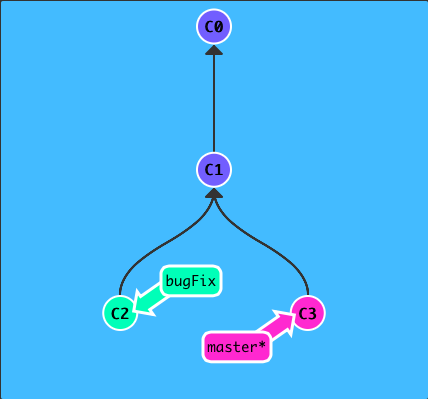
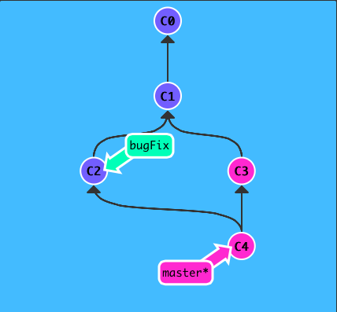
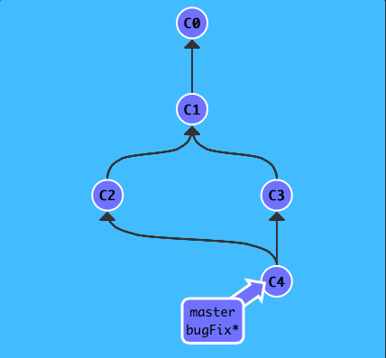
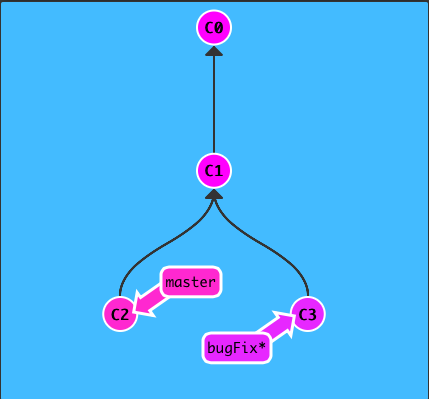
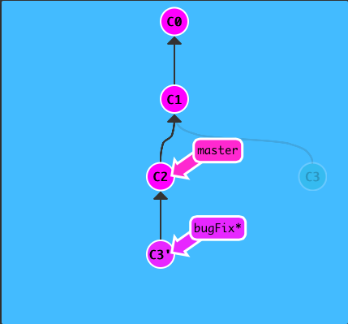
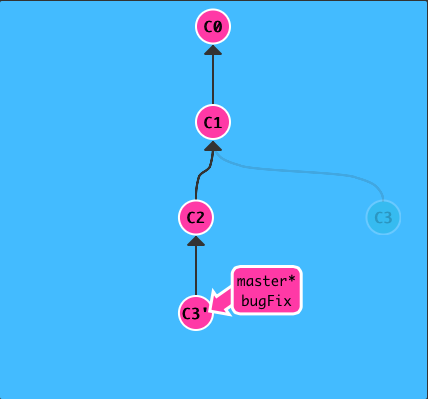

**Merge**

The first method to combine work that we will examine is git merge. Merging in Git creates a special commit that has two unique parents. A commit with two parents essentially means "I want to include all the work from this parent over here and this one over here, and the set of all their parents."

Here we have two branches; each has one commit that's unique. This means that neither branch includes the entire set of "work" in the repository that we have done. Let's fix that with merge.

We will merge the branch `bugFix` into `master`

	git merge bugFix
	

	
Woah! See that? First of all, master now points to a commit that has two parents. If you follow the arrows up the commit tree from master, you will hit every commit along the way to the root. This means that master contains all the work in the repository now.

Also, see how the colors of the commits changed? To help with learning, I have included some color coordination. Each branch has a unique color. Each commit turns a color that is the blended combination of all the branches that contain that commit.

So here we see that the master branch color is blended into all the commits, but the bugFix color is not. Let's fix that...

Let's merge master into bugFix:

	git checkout bugFix; git merge master
	

	
Since `bugFix` was an ancestor of `master`, git didn't have to do any work; it simply just moved `bugFix` to the same commit `master` was attached to.

Now all the commits are the same color, which means each branch contains all the work in the repository! Woohoo!

**Rebase**

The second way of combining work between branches is rebasing. Rebasing essentially takes a set of commits, "copies" them, and plops them down somewhere else.

While this sounds confusing, the advantage of rebasing is that it can be used to make a nice linear sequence of commits. The commit log / history of the repository will be a lot cleaner if only rebasing is allowed.

Here we have two branches yet again; note that the bugFix branch is currently selected (note the asterisk)

We would like to move our work from bugFix directly onto the work from master. That way it would look like these two features were developed sequentially, when in reality they were developed in parallel.

Let's do that with the `git rebase` command

	git rebase master
	

Awesome! Now the work from our bugFix branch is right on top of master and we have a nice linear sequence of commits.

Note that the commit C3 still exists somewhere (it has a faded appearance in the tree), and C3' is the "copy" that we rebased onto master.

The only problem is that master hasn't been updated either, let's do that now...

Now we are checked out on the `master` branch. Let's go ahead and rebase onto `bugFix`...

	git rebase bugFix
	
There! Since `master` was an ancestor of `bugFix`, git simply moved the `master` branch reference forward in history.

